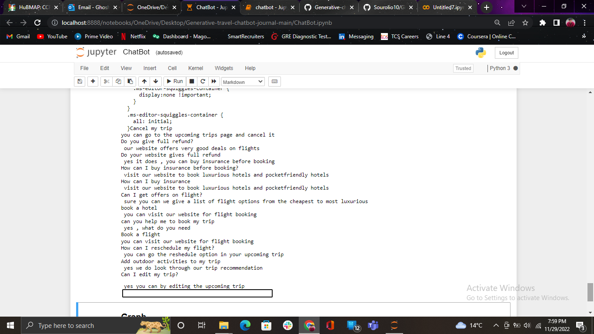
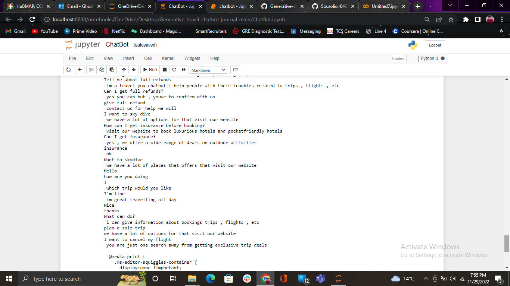

The model is 32 mb. So couldn't upload it in github. 
Here's the drive link more the model: https://drive.google.com/file/d/1eJdj9MZygb3E3pox-N3Qdi9IxwjOxLy_/view?usp=sharing 
Use Pythom 3.7 for execution. Tensorflow Keras doesn't work on updated versions. 
Some executions: 
 
 
 
 

